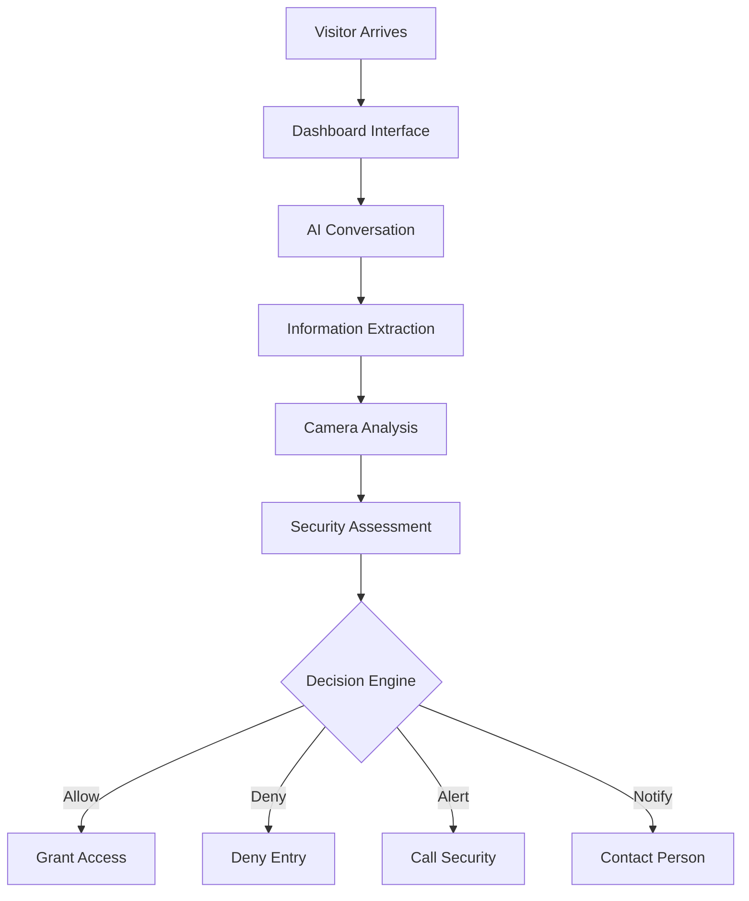

# 🤖 Gatekeeper - AI Security Gate System

A security gate system that combines computer vision, natural language processing, and multi-agent AI to automate visitor screening and access control at security checkpoints.

## Features

### AI-Powered Conversation

- Interactive visitor screening through natural language dialogue
- Context-aware information extraction (name, purpose, affiliation, contact person)
- Conversation summarization for extended interactions
- Session continuity detection

### Computer Vision Analysis

- Real-time face detection and threat assessment
- Dangerous object detection
- Emotion analysis and behavioral pattern recognition
- Base64 image processing pipeline

### Security Decision Engine

- Multi-factor security assessment combining visual and conversational data
- Automated decisions: `allow_entry`, `deny_entry`, `call_security`, `notify_contact`
- Confidence scoring with detailed reasoning
- Employee database authentication and door-specific access control

### Real-time Communication

- Socket.IO for instant client-server communication
- Multi-process architecture for concurrent processing
- Queue-based message handling
- Live dashboard updates

## Architecture

### Backend (Python)

- **Framework**: FastAPI with Socket.IO integration
- **AI Orchestration**: LangChain + LangGraph for agent workflows
- **LLM Models**: Ollama-hosted Qwen 3:4b (text) and Gemma 3:4b (vision)
- **State Management**: Graph-based conversation flow with automatic context management

### Frontend (React + TypeScript)

- **Framework**: React with TypeScript and Vite
- **Real-time Updates**: Socket.IO client integration
- **UI Components**: Modern component library with CSS modules
- **Camera Integration**: WebRTC for live video capture

### Key Components

```
text_agent/          # AI backend service
├── src/core/        # State management and graph workflow
├── src/nodes/       # Processing nodes (input, decision, analysis)
├── models/          # LLM configuration and management
├── config/          # Prompts, schemas, and settings
└── data/            # Employee database and logs

dashboard/           # React frontend
├── src/components/  # UI components (Camera, ThreatLog, etc.)
├── src/pages/       # Dashboard views
└── src/services/    # Socket client and API integration
```

## 🚀 Quick Start

### Prerequisites

- Docker & Docker Compose
- Python 3.11+
- Node.js 18+
- Ollama with Qwen and Gemma models

### Installation

1. **Clone the repository**

   ```bash
   git clone <repository-url>
   cd gatekeeper
   ```

2. **Start the AI backend**

   ```bash
   cd text_agent
   docker-compose up -d
   ```

3. **Launch the dashboard**

   ```bash
   cd dashboard
   npm install
   npm run dev
   ```

4. **Configure models**
   ```bash
   # Install required Ollama models
   ollama pull qwen2.5:3b
   ollama pull llama3.2-vision:11b
   ```

## 🔧 Configuration

### Environment Variables

```bash
# AI Backend
OLLAMA_HOST=http://localhost:11434
MAX_HUMAN_MESSAGES=20
CONVERSATION_TIMEOUT=300

# Dashboard
VITE_SOCKET_URL=http://localhost:8000
```

### Model Configuration

Edit `text_agent/models/llm_config.py` to customize:

- Model selection and parameters
- Temperature settings for different tasks
- JSON schema validation

## Security Features

- **Employee Authentication**: Database-backed employee verification
- **Threat Detection**: Visual analysis for dangerous objects and suspicious behavior
- **Access Control**: Door-specific permissions and authorization
- **Audit Trail**: Comprehensive logging of all interactions and decisions
- **Real-time Alerts**: Instant notifications for security events

## System Flow



## Development

### Project Structure

- **Multi-agent AI**: LangGraph-based conversation flow
- **Modular Design**: Separate nodes for different processing tasks
- **Scalable Architecture**: Queue-based processing for high throughput
- **Real-time Updates**: WebSocket communication for live dashboard

### API Documentation

- Backend API: `text_agent/API_DOC.md`
- Socket Events: `text_agent/SOCKET_DOC.md`
