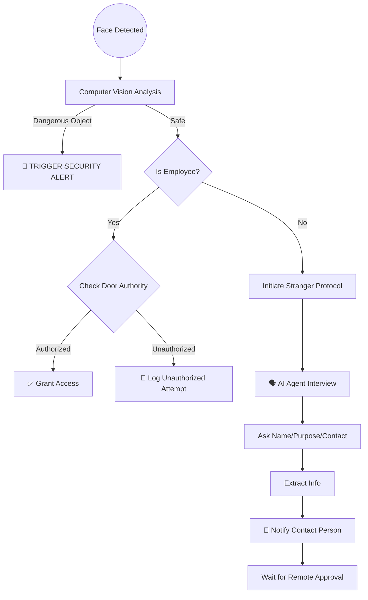

# 🤖 Gatekeeper - Agentic Multi-Camera Security System

  
  


**Gatekeeper** is an advanced, agentic security system that transforms standard surveillance into an active access control authority. Combining computer vision, Local LLMs, and multi-agent workflows, it manages multiple entry points simultaneously, distinguishing between authorized employees and visitors in real-time.

Unlike passive recording systems, Gatekeeper **acts**: it grants access, interrogates strangers, detects threats, and notifies hosts autonomously.

---

## 🌟 Core Features

### 1. Multi-Camera & Multi-Zone Architecture

- **Simultaneous Monitoring:** Supports multiple camera feeds running concurrently via multi-processing.
- **Zone Authority:** Each camera represents a specific physical location (e.g., "Server Room", "Main Lobby") with unique security clearance requirements.
- **Context Isolation:** Each camera maintains its own conversation state and event log, preventing cross-talk between different entry points.

---

### 2. Intelligent Access Control (The "Employee Flow")

- **Face-to-Auth:** Instantly recognizes registered employees via face detection.
- **Authority Check:** Verifies if the recognized employee has the specific clearance level for the door they are attempting to open.
  - **Authorized:** Silently grants access (`allow_entry`), unlocks the door, and logs the entry.
  - **Unauthorized:** Denies access, logs the security violation, and alerts admins.

---

### 3. Agentic Visitor Screening (The "Stranger Flow")

- **Active Interrogation:** If a face is unknown, the AI Agent initiates a natural language voice interview.
- **Data Extraction:** Dynamically extracts required fields:
  - _Full Name_
  - _Purpose of Visit_
  - _Contact Person_

- **Verification & Notification:** Validates the contact person against the internal directory and sends a direct notification to them with the visitor's details to request approval.

---

### 4. Threat & Safety Intelligence

- **Object Detection:** Real-time visual analysis to detect dangerous objects (weapons, unknown tools in restricted areas).
- **Escalation:** Immediately locks doors and triggers "Call Security" or "Log Incident" protocols upon threat detection.

---

### 5. Session Lifecycle Management

- **Face Activation:** The agent wakes up and initializes a session only when a human face is detected.
- **Short-Term Memory:** Maintains context (conversation history) only for the duration of the interaction.
- **Auto-Clear:** Automatically wipes sensitive session data and resets the state when the subject leaves the frame, ensuring privacy for the next user.

---

## 🏗️ Architecture

### Backend (Python & AI)

- **Orchestration:** LangChain + LangGraph for stateful multi-agent workflows.
- **Vision:** `gemma` (or custom tuned models) for face and object analysis.
- **LLM:** Flexible support for Local LLMs (via Ollama, e.g., `Qwen3`) or Cloud APIs (OpenAI, Anthropic, etc.) for broader model choices.
- **Concurrency:** Multiprocessing implementation to handle separate camera streams without blocking.
- **Communication:** FastAPI + Socket.IO for low-latency, bi-directional event streaming.

---

### Frontend (React Dashboard)

- **Live Monitoring:** Grid view of all active cameras/doors.
- **Real-Time Logs:** Streaming transcript of AI-Visitor conversations and decision events.
- **Technology:** React, TypeScript, Vite, Socket.IO client for real-time updates.

---

## 🧠 Logic Flow


```mermaid
graph TD
    Start((Face Detected)) --> Vision[Computer Vision Analysis]

    Vision -->|Dangerous Object| Threat[🚨 TRIGGER SECURITY ALERT]
    Vision -->|Safe| Identify{Is Employee?}

    %% Employee Flow
    Identify -->|Yes| Auth{Check Door Authority}
    Auth -->|Authorized| Grant[✅ Grant Access]
    Auth -->|Unauthorized| LogAttempt[📝 Log Unauthorized Attempt]

    %% Visitor Flow
    Identify -->|No| Stranger[Initiate Stranger Protocol]
    Stranger --> Interview[🗣️ AI Agent Interview]
    Interview --> Q1[Ask Name/Purpose/Contact]
    Q1 --> Extract[Extract Info]
    Extract --> Notify[📲 Notify Contact Person]
    Notify --> Wait[Wait for Remote Approval]
```

---

# 🚀 Quick Start

## Prerequisites

- Docker & Docker Compose
- Python 3.11+
- Node.js 18+
- Ollama running locally (optional, if using local models)

---

## Installation

### 1️⃣ Clone the Repository

```bash
git clone <repository-url>
cd gatekeeper
```

### 2️⃣ Setup Models (Ollama)

Ensure your local LLM host has the required models:

```bash
ollama pull qwen3:3b
ollama pull gemma:2b
```

### 3️⃣ Start the AI Backend

```bash
cd text_agent

# Copy env example
cp .env.example .env

# Start the container cluster
docker-compose up -d
```

### 4️⃣ Launch the Dashboard

```bash
cd dashboard
npm install
npm run dev
```

---

# 🔧 Configuration

## Defining Doors & Authority

Configure your cameras and their security levels in:

```
text_agent/config/cameras.yaml
```

```yaml
cameras:
  - id: "cam_01"
    name: "Main Lobby Entrance"
    device_index: 0
    required_clearance: "public_access"
    mode: "hybrid" # Allows strangers to initiate interview

  - id: "cam_02"
    name: "Server Room B"
    device_index: 1
    required_clearance: "sysadmin"
    mode: "strict" # No interview, employees only. Deny all others.
```

---

## Environment Variables

Edit `.env` to tune performance and thresholds:

```bash
OLLAMA_HOST=http://localhost:11434

# Time in seconds to hold memory before auto-clearing
SESSION_TIMEOUT=30

# Minimum confidence to grant employee access (0.0 - 1.0)
FACE_MATCH_THRESHOLD=0.85

# Max conversation turns before forcing a decision
MAX_INTERACTION_TURNS=5
```

---

# 📂 Project Structure

```
gatekeeper/
├── text_agent/              # Python Backend
│   ├── src/
│   │   ├── agents/          # LangGraph Agent definitions (Interviewer, Guard)
│   │   ├── vision/          # Object & Face detection pipelines
│   │   ├── db/              # Vector DB for faces & SQLite for Event Logs
│   │   └── camera/          # Multi-camera streaming logic & Frame buffers
│   ├── config/              # Camera & Authority definitions
│   └── main.py              # Application entry point
│
└── dashboard/               # React Frontend
    ├── src/
    │   ├── components/      # CameraGrid, LogStream, ThreatAlert
    │   └── hooks/           # Socket.IO hooks
    └── public/
```

---

# 🛡️ Security & Privacy

- **Event Logging:** All access attempts, conversations, and threat detections are immutably logged with timestamps and snapshots.
- **Ephemeral Sessions:** No conversational data is stored beyond the immediate session context.
- **Local Processing:** By default, AI inference runs locally via Ollama to ensure video feeds never leave your private network. Cloud APIs can be substituted if desired.
